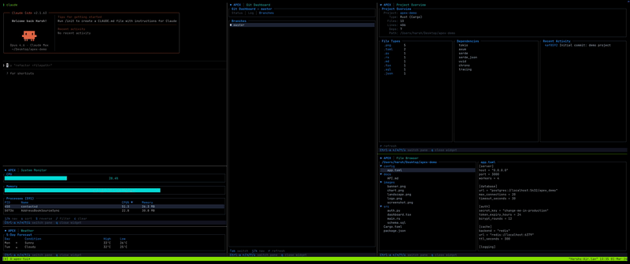

# Apex

**AI-native TUI workspace for Claude Code.**

Speak your intent in natural language and Claude spawns rich, interactive terminal widgets in tmux panes. No mouse, no GUI, no distractions.

> "show me system stats" &rarr; live CPU/memory dashboard appears
> "open file browser at ~/projects" &rarr; syntax-highlighted tree view
> "start a pomodoro timer" &rarr; ASCII art countdown

 

## Demo



## How It Works

```
Claude Code  <--MCP stdio-->  apex-mcp (Rust)
                                  |
                            spawns tmux panes
                                  |
                         apex-tui (Rust, ratatui)
                                  |
                         IPC via Unix sockets
```

- **apex-mcp** is an MCP server that Claude Code connects to. It exposes 4 tools: `spawn_widget`, `update_widget`, `query_widget`, `close_widget`.
- **apex-tui** renders widgets using [ratatui](https://github.com/ratatui/ratatui). Each widget runs as its own process in a tmux pane.
- **apex-common** contains shared IPC protocol types.

Claude controls the widgets through MCP tools. You interact with widgets directly via keyboard. Switch between Claude and widget panes with `Ctrl-a + arrow keys`.

## Requirements

- **Rust** (stable toolchain)
- **tmux** (>= 3.3 recommended for image support)
- **Claude Code** CLI
- **macOS** or **Linux**
- **mcat** (optional, for high-quality image rendering) &mdash; `cargo install mcat`

## Installation

### 1. Clone and build

```bash
git clone https://github.com/harsh7z/apex.git
cd apex
cargo build --release
```

### 2. Configure tmux

Add to your `~/.tmux.conf`:

```tmux
# Recommended: change prefix to Ctrl-a (less conflict with terminal shortcuts)
unbind C-b
set -g prefix C-a
bind C-a send-prefix

# Required for image rendering through tmux
set -g allow-passthrough on
```

Reload with `tmux source-file ~/.tmux.conf`.

### 3. Connect to Claude Code

From the apex directory:

```bash
claude mcp add --transport stdio --scope user apex ./target/release/apex-mcp
```

Or add manually to your Claude Code MCP config:

```json
{
  "mcpServers": {
    "apex": {
      "command": "/path/to/apex/target/release/apex-mcp"
    }
  }
}
```

### 4. Start using

Open a tmux session and start Claude Code:

```bash
tmux
claude
```

Then just ask:

```
> show me system stats
> open a file browser at ~/projects
> show me the weather in Tokyo
> start a timer
```

## Widgets

### System Monitor
Live CPU, memory, and process table.

| Key | Action |
|-----|--------|
| `j/k` | Navigate process list |
| `s` | Cycle sort column (CPU/Memory/Name/PID) |
| `S` | Reverse sort order |
| `/` | Filter processes by name |
| `c` | Clear filter |

### Git Dashboard
Three-tab view: Status, Log, Branches with diff preview.

| Key | Action |
|-----|--------|
| `Tab` / `Shift+Tab` | Switch tabs |
| `j/k` | Navigate items |
| `r` | Refresh |

### File Browser
Tree view with syntax-highlighted preview. Image files are previewed using the Kitty graphics protocol.

| Key | Action |
|-----|--------|
| `j/k` | Navigate tree |
| `Enter` / `l` | Expand directory |
| `h` | Collapse directory |
| `J/K` | Scroll preview |

### Project Overview
Auto-detects project type (Rust, Node.js, Go, Python, Ruby, Java, C/C++) and shows file counts, line counts, dependencies, and recent git activity.

| Key | Action |
|-----|--------|
| `j/k` | Scroll |
| `r` | Refresh analysis |

### Weather
Displays current conditions and 5-day forecast for any city.

| Key | Action |
|-----|--------|
| `c` | Change city |
| `r` | Refresh |

### Todo List
Persistent task manager with priorities. Saves to `/tmp/apex-todos.json`.

| Key | Action |
|-----|--------|
| `j/k` | Navigate |
| `a` | Add new todo |
| `Enter` | Toggle done |
| `d` | Delete |
| `p` | Cycle priority (Low/Medium/High) |
| `x` | Clear completed |

### Calculator
Expression evaluator with operator precedence and parentheses.

| Key | Action |
|-----|--------|
| `0-9`, `.` | Enter numbers |
| `+-*/` | Operators |
| `()` | Parentheses |
| `Enter` | Evaluate |
| `c` | Clear |
| `Backspace` | Delete last char |

### Timer
Stopwatch, countdown timer, and Pomodoro mode with ASCII art display.

| Key | Action |
|-----|--------|
| `Space` | Start / Pause |
| `r` | Reset |
| `m` | Switch mode (Stopwatch/Timer/Pomodoro) |
| `+/-` | Adjust duration |

### Disk Usage
Filesystem usage gauges and directory size breakdown.

| Key | Action |
|-----|--------|
| `j/k` | Navigate mounts |
| `r` | Refresh |

### Clipboard History
Watches the system clipboard and maintains a searchable history (macOS).

| Key | Action |
|-----|--------|
| `j/k` | Navigate |
| `Enter` | Copy selected to clipboard |
| `d` | Delete entry |
| `/` | Search/filter |
| `c` | Clear filter |

### Image Viewer
Display images in the terminal using the Kitty graphics protocol (with halfblock fallback). Best used via `spawn_widget` with a `path` parameter pointing to an image file.

| Key | Action |
|-----|--------|
| `+/-` | Zoom in/out |
| `f` | Fit to window |
| `1` | Actual size (1:1) |
| `r` | Reset view |

## MCP Tools Reference

Claude uses these tools automatically based on your requests. You can also reference them when building your own integrations.

### `spawn_widget`

Spawn a new widget in a tmux pane.

| Parameter | Type | Description |
|-----------|------|-------------|
| `widget_type` | string | One of: `system_monitor`, `git_dashboard`, `file_browser`, `project_overview`, `weather`, `todo_list`, `calculator`, `timer`, `disk_usage`, `clipboard_history`, `image_viewer` |
| `position` | string | `right` (default) or `bottom` |
| `size` | number | Pane size as percentage, 10-80 (default 40) |
| `path` | string | Optional path or context (directory for file_browser, city for weather, image path for image_viewer) |

### `update_widget`

Send a command to a running widget.

| Parameter | Type | Description |
|-----------|------|-------------|
| `widget_id` | string | Widget ID returned by `spawn_widget` |
| `command` | string | Command name (varies by widget) |
| `data` | JSON | Optional command data |

### `query_widget`

Get structured data from a widget.

| Parameter | Type | Description |
|-----------|------|-------------|
| `widget_id` | string | Widget ID |
| `query` | string | Query name (e.g., `cpu_usage`, `status`, `list`) |

### `close_widget`

Close a widget. Pass `widget_id: "all"` to close all widgets.

| Parameter | Type | Description |
|-----------|------|-------------|
| `widget_id` | string | Widget ID or `"all"` |

## Global Controls

Every widget displays a help bar at the bottom:

| Key | Action |
|-----|--------|
| `Ctrl-a + arrow keys` | Switch focus between Claude and widget panes |
| `q` | Close the current widget |

## Project Structure

```
apex/
├── Cargo.toml                     # Workspace root
├── crates/
│   ├── apex-common/src/
│   │   ├── lib.rs                 # Re-exports
│   │   ├── protocol.rs            # IPC message types (McpToTui, TuiToMcp)
│   │   └── widget_id.rs           # UUID-based widget ID generation
│   ├── apex-mcp/src/
│   │   ├── main.rs                # MCP stdio server (rmcp)
│   │   ├── tmux.rs                # Pane spawn/kill/detect
│   │   ├── ipc.rs                 # Unix socket client
│   │   └── tools/                 # MCP tool implementations
│   │       ├── spawn.rs
│   │       ├── update.rs
│   │       ├── query.rs
│   │       └── close.rs
│   └── apex-tui/src/
│       ├── main.rs                # CLI entry, widget instantiation
│       ├── app.rs                 # TEA-pattern event loop
│       ├── event.rs               # Keyboard + IPC event multiplexing
│       ├── ipc_server.rs          # Unix socket server
│       ├── theme.rs               # Color palette
│       └── widgets/               # All 11 widget implementations
├── .claude/settings.json          # MCP server registration
└── .gitignore
```

## Building from Source

```bash
# Debug build (faster compilation)
cargo build --workspace

# Release build (optimized)
cargo build --release --workspace

# Run apex-tui directly (for testing)
./target/debug/apex-tui --widget system_monitor --socket /tmp/test.sock
```

## Troubleshooting

**"Not inside a tmux session"**
Apex requires tmux. Start a tmux session first: `tmux`

**Widget opens and immediately closes**
Check that `apex-tui` is in the same directory as `apex-mcp` or in your `PATH`.

**Images are pixelated**
1. Ensure `allow-passthrough on` is in your `~/.tmux.conf`
2. Reload tmux: `tmux source-file ~/.tmux.conf`
3. Use a terminal with Kitty graphics protocol support (Ghostty, Kitty, WezTerm)

**Can't switch focus to widget**
Press `Ctrl-a` then an arrow key (not `Ctrl-a + arrow` simultaneously).

**MCP not connecting**
Run `claude mcp list` to verify apex is registered. Re-add with:
```bash
claude mcp add --transport stdio --scope user apex /path/to/apex-mcp
```

## License

MIT
